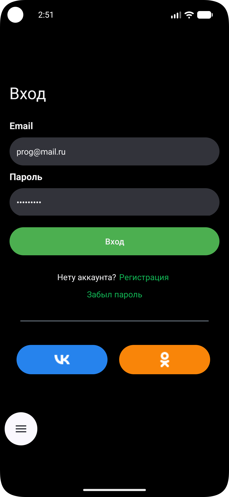

**Application for viewing training courses with authorization.**

Tech Stack:
-Kotlin

-MVVM + Clean Architecture

-Hilt (DI)

-Retrofit (Mock answers via GitHub Pages)

-Room (Local favorites).Not yet fully implemented

-ViewBinding

-RecyclerView + AdapterDelegates

-Glide

-Coroutines + StateFlow

**Retrofit is used to load courses, with a base URL pointing to GitHub Pages:**

The courses.json and login.json files are located in a separate public repository and are available at this link:

- https://your-username.github.io/your-repo/courses.json

- https://your-username.github.io/your-repo/login.json

**Authorization**
-Enter email and password

-Email validation via Regex

-States: Idle / Loading / Success / Error

-Transition to MainActivity on success

**Courses**
-Download from mock repository

-Sort by publication date

-Adapter with delegates and Glide

<h3>Login screen</h3>

<h3>Home screen</h3>

